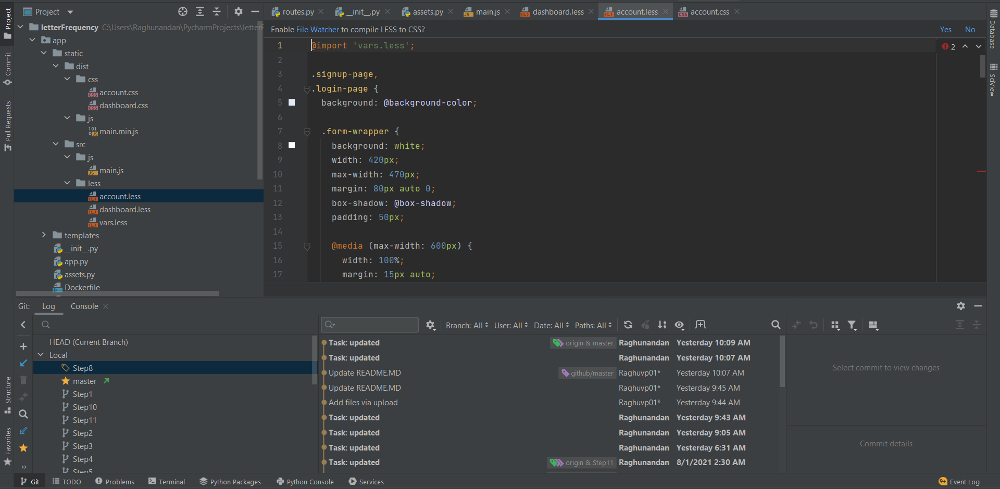
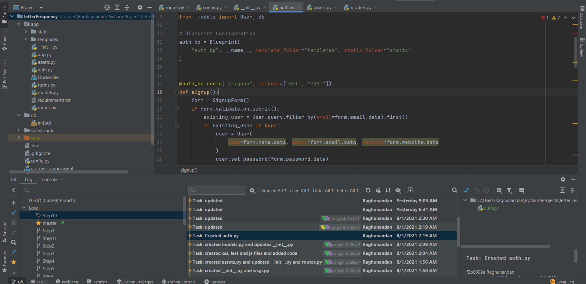
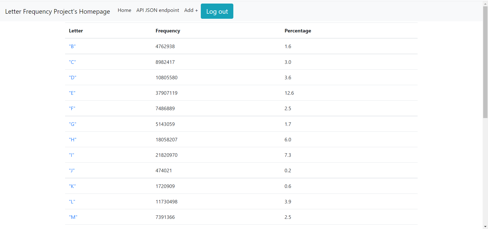

# Project Description
This Project is about letters frequency using Python, flask, MySQL and Docker
# Screenshots of completion of steps
### Step 1

### Step 2

### Step 3

### Step 4

### Step 5

### Step 6

### Step 7

### Step 8

### Step 9

### Step 10

### Step 11

# Screenshots of project
### Login Page

### Register Page

### Homepage
 
### Viewpage

### Editpage

### Newpage

### API JSON Endpoint
  
# Postman Screenshot

# SQL data screenshot

